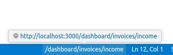

# Next Route Path

display nextjs route pathname corresponding to active file in status bar.  
在状态栏显示当前文件的 next 路由路径。



## Features

1. According to [App Router](https://nextjs.org/docs/app/building-your-application/routing),display pathname corresponding to the current file in status bar.  
   根据 next 的 App Router 规则，在状态栏显示当前文件的 pathname。

2. Copy url to clipboard when click the status bar item.  
   点击状态栏项，将 url 复制到剪切板。

## Extension Settings

- `NextRoutePath.baseUrl`: Specifies the base URL of your project.
  ```json
  "NextRoutePath.baseUrl": "http://localhost:3000"
  ```

## Requirements

only works on **nextjs** project
extension becomes activated automatically when: workspace contains **`next.config.*`**  
仅在 nextjs 项目下生效，当工作区中包含 `next.config.*` 时启用

## Known Issues

---

**Enjoy!**
